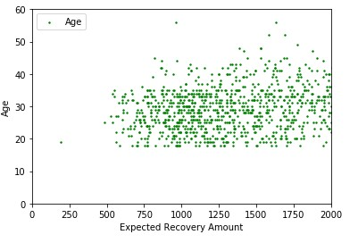

<h2 align='center'>Which-Debts-Are-Worth-the-Bank-s-Effort<br>:dollar::moneybag::dollar:</h2>


 


<p>&nbsp;&nbsp; After a debt has been legally declared "uncollectable" by a bank, 
the account is considered "charged-off." 
But that doesn't mean the bank walks away from the debt. 
They still want to collect some of the money they are owed. 
The bank will score the account to assess the expected recovery amount, that is,
<code>the expected amount</code> that the bank may be able to receive from the customer in the future. 
This amount is a function of the probability of the customer paying, the total debt, 
and other factors that impact the ability and willingness to pay.</p>

<h3>1. Regression discontinuity: banking recovery</h3>

<p>&nbsp;&nbsp;The bank has implemented different recovery strategies at different 
thresholds ($1000, $2000, etc.) where the greater the expected recovery amount, 
the more effort the bank puts into contacting the customer. For low recovery amounts (Level 0), 
the bank just adds the customer's contact information to their automatic dialer and emailing system. 
For higher recovery strategies, the bank incurs more costs as they leverage human resources in more efforts to obtain payments. Each additional level of recovery strategy requires an additional $50 per customer so that customers in the 
Recovery Strategy Level 1 cost the company $50 more than those in Level 0. 
Customers in Level 2 cost $50 more than those in Level 1, etc. </p>

<p><b>The big question</b>: does the extra amount that is recovered at 
the higher strategy level exceed the extra $50 in costs? 
In other words, was there a jump (also called a "discontinuity") of more than $50 in the amount recovered 
at the higher strategy level? </p>

```python
df = pd.read_csv("datasets/bank_data.csv" )
df.head()
```
| id | expected_recovery_amount | actual_recovery_amount | recovery_strategy |              age | sex |        |
|---:|-------------------------:|-----------------------:|------------------:|-----------------:|----:|--------|
|  0 | 2030                     | 194                    | 263.540           | Level 0 Recovery | 19  | Male   |
|  1 | 1150                     | 486                    | 416.090           | Level 0 Recovery | 25  | Female |
|  2 | 380                      | 527                    | 429.350           | Level 0 Recovery | 27  | Male   |
|  3 | 1838                     | 536                    | 296.990           | Level 0 Recovery | 25  | Male   |
|  4 | 1995                     | 541                    | 346.385           | Level 0 Recovery | 34  | Male   |  


<h3>2. Graphical exploratory data analysis</h3>
<p>Quick summary of the Levels and thresholds again:   
  <ul>
    <li>Level 0: Expected recovery amounts >$0 and <=$1000</li>  
  <li>Level 1: Expected recovery amounts >$1000 and <=$2000</li>        
  <li>The threshold of $1000 separates Level 0 from Level 1</li>        
   </ul>A key question is whether there are other factors besides <code>Expected Recovery Amount</code> that also varied systematically across the $1000 threshold.<br>How about <code>age</code>?
</p>

```python
plt.scatter(x=df['expected_recovery_amount'], y=df['age'], c="g", s=2)
plt.xlim(0, 2000)
plt.ylim(0, 60)
plt.show()
```



<h3>3. Statistical test: age vs. expected recovery amount</h3>

<p>&nbsp;&nbsp; We want to convince ourselves that variables such as <code>age</code> and <code>sex</code>
are similar above and below the $1000 Expected Recovery Amount threshold. 
This is important because we want to be able to conclude that differences 
in the actual recovery amount are due to the higher Recovery Strategy and 
not due to some other difference like <code>age</code> or <code>sex</code>.
</p>

```python
from scipy import stats

# average age just below and above the threshold
era_900_1100 = df.loc[(df['expected_recovery_amount']<1100) & 
                      (df['expected_recovery_amount']>=900)]
by_recovery_strategy = era_900_1100.groupby(['recovery_strategy'])
by_recovery_strategy['age'].describe().unstack()

#  Kruskal-Wallis test 
Level_0_age = era_900_1100.loc[df['recovery_strategy']=="Level 0 Recovery"]['age']
Level_1_age = era_900_1100.loc[df['recovery_strategy']=="Level 1 Recovery"]['age']

>>> print(stats.kruskal(Level_0_age,Level_1_age))
... KruskalResult(statistic=3.4572342749517513, pvalue=0.06297556896097407)
```


<h3>4. Statistical test: sex vs. expected recovery amount</h3>

<p>&nbsp;&nbsp; We have seen that there is no major jump in the average customer <code>age</code> just above and just below the $1000 threshold by doing a statistical test as well as exploring it graphically with a scatter plot.</p>

<p>&nbsp;&nbsp; We want to also test that the percentage of customers that are <code>male</code> does not jump across the $1000 threshold. We can start by exploring the range of $900 to $1100 and later adjust this range.</p>

```python
# Number of customers in each category
crosstab = pd.crosstab(df.loc[(df['expected_recovery_amount']<1100) & 
                              (df['expected_recovery_amount']>=900)]['recovery_strategy'], 
                       df['sex'])
>>> print(crosstab)
...
```
|               sex | Female | Male |
|------------------:|-------:|-----:|
| recovery_strategy |        |      |
|  Level 0 Recovery | 32     | 57   |
|  Level 1 Recovery | 39     | 55   |

```python
# Chi-square test
chi2_stat, p_val, dof, ex = stats.chi2_contingency(crosstab)
>>> print(p_val)
... 0.5377947810444592
```


<h3>5. Exploratory graphical analysis: recovery amount</h3>
<p>&nbsp;&nbsp; We are now reasonably confident that customers just above and just below the $1000 threshold are, on average, similar in their average age and the percentage that are male.</p>

<p>&nbsp;&nbsp; It is now time to focus on the key outcome of interest, the actual recovery amoun
</p>

<p>&nbsp;&nbsp; Let's make a scatter plot of <code>Expected Recovery Amount</code> (X) 
versus <code>Actual Recovery Amount</code> (Y) for Expected Recovery 
Amounts between $900 to $1100. This range covers Levels 0 and 1. 
A key question is whether or not we see a discontinuity (jump) around the $1000 threshold.
</p>

```python
plt.scatter(x=df['expected_recovery_amount'], y=df['actual_recovery_amount'], c="g", s=2)
plt.xlim(900, 1100)
plt.ylim(0, 2000)
plt.show()
```


<h3>6. Statistical analysis: Recovery Amount</h3>

<p>&nbsp;&nbsp; As we did with age, we can perform statistical tests to see if the actual recovery amount has a discontinuity above the $1000 threshold.<br>We will use the Kruskal-Wallis test, again.We will repeat the steps for a smaller window of $950 to $1050.</p>

```python
by_recovery_strategy['actual_recovery_amount'].describe().unstack()

Level_0_actual = era_900_1100.loc[df['recovery_strategy']=='Level 0 Recovery']['actual_recovery_amount']
Level_1_actual = era_900_1100.loc[df['recovery_strategy']=='Level 1 Recovery']['actual_recovery_amount']

>>> print(stats.kruskal(Level_0_actual, Level_1_actual))
... KruskalResult(statistic=65.37966302528878, pvalue=6.177308752803109e-16)

# Repeat for a smaller range of $950 to $1050
era_950_1050 = df.loc[(df['expected_recovery_amount']<1050) & 
                      (df['expected_recovery_amount']>=950)]
                      
Level_0_actual = era_950_1050.loc[df['recovery_strategy']=='Level 0 Recovery']['actual_recovery_amount']
Level_1_actual = era_950_1050.loc[df['recovery_strategy']=='Level 1 Recovery']['actual_recovery_amount']

>>>print(stats.kruskal(Level_0_actual, Level_1_actual))
... KruskalResult(statistic=30.246000000000038, pvalue=3.80575314300276e-08)
```

<h3></h3>
<h3></h3>
<h3></h3>
